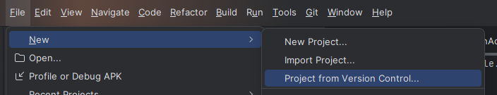
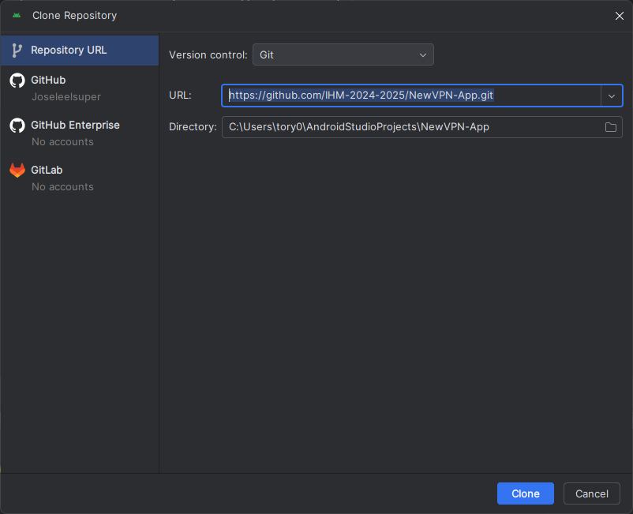
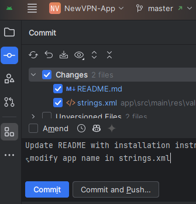
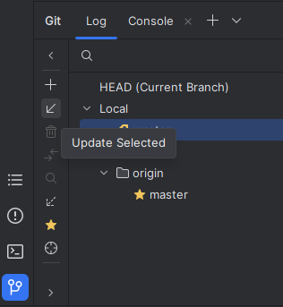

# NewVPN App

Aplicación móvil de VPN. Práctica de Interacción Hombre-Máquina 2024/2025.

## Índice

- [Instalación](#instalación)
- [Subir cambios](#subir-cambios)
- [Traer cambios de otros a local](#traer-cambios-de-otros-a-local)
- [Miembros del grupo](#miembros-del-grupo)
- [Licencia](#licencia)

## Instalación

Copia el siguiente enlace:

```txt
https://github.com/IHM-2024-2025/NewVPN-App.git
```

1. Arriba, clic en `File` -> `New` -> `Project from Version Control...`
2. Pegar el enlace en el campo de URL.
3. Clic en `Clone`.



---


## Subir cambios

1. Arriba izquierda, Ir al icono de commits.
2. Añadir un comentario al commit.
3. Hacer clic en el botón de `commit and push` para subir los cambios directamente.



## Traer cambios de otros a local

1. Abajo izquierda, clic al icono de git.
2. Clic a la etiqueta `master` dentro del desplegable `Local`.
3. Clic a la flecha de `Update Selected`.



## Miembros del grupo

[](https://github.com/IHM-2024-2025/NewVPN-App/graphs/contributors)

## Licencia

Este proyecto está bajo la licencia MIT. Consulte el archivo [LICENSE](LICENSE) para obtener más información.
